# DIGITAL DESIGN ON  VIRTUAL FPGA
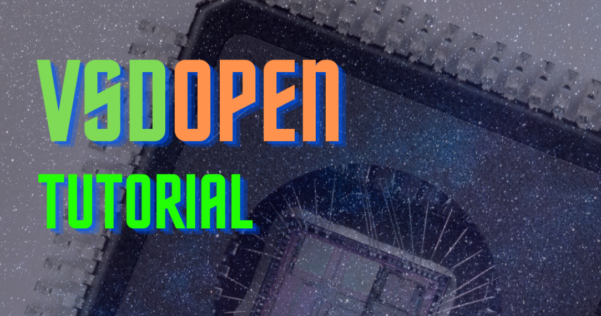
## **_contents of the course_**
- [About the tutorial](#about-the-tutorial)
- [Introduction to Virtual FPGA](#Introduction-to-Virtual-FPGA)
- [Makerchip Platform](#makerchip-platform)
- [Virtual FPGA Boards](#virtual-fpga-boards)
- [Leds Interfacing](#Leds-interfacing)
- [7 segment display interfacing](#7segment-display-interfacing)
- [4-Way Traffic Light Controller Design](#4way-traffic-light-controller-design)
- [Finite State Machine](#FINITE-STATE-MACHINE)
- [References](#references)
- [Acknowledgement](#acknowledgement)

## **_About the tutorial_**

In this 'DIGITAL DESIGN ON  VIRTUAL FPGA' conducted by [VLSI System Design]( https://www.vlsisystemdesign.com/).
 - We have learned about what is FPGA & its advantages over ASICS.
 - A introduction on Makerchip Platform & the Virtual FPGA Boards available at the Makerchip website.
 - Introduction to LEDs and seven-segment & Interfacfing LEDS & seven segment displays.
 - Introduction to Finite State Machines theory
 - Verilog Finite State Machine implementation of traffic light controller design.

## **_Introduction to Virtual FPGA_**

 - Field-Programmable Gate Array(FPGA) is a hardware circuit that a user can program to carry out logical operations.
 - FPGAs are beneficial for prototyping application-specific integrated circuits (ASICs) or processors
 - The advantage of FPGA beproject Virtual FPGA Lab aims to solve the problem by taking advantage of the VIZ Visualization feature in the Makerchip platform and providing visualisations of FPGA’s basic peripherals, thereby mimicking the physical lab experienceing energy-efficient, flexible to reprogram, support parallelism, decreased latency made them widely used in many applications.
 
## **_Makerchip Platform_**
 - Makerchip is a free web-based IDE as well as available as makerchip-app, a virtual desktop application for developing high-quality integrated circuits.
 - A virtual desktop application for developing high-quality integrated circuits. we can code, compile, simulate, and debug Verilog designs, with help of our browser. Your code, block diagrams, and waveforms are tightly integrated.
 - Makerchip supports the emerging Transaction-Level Verilog standard.
 - Transaction-Level Verilog, or TL-Verilog, represents a huge step forward by eliminating the need for the legacy language features of Verilog and by introducing simpler syntax.
 - At the same time, TL-Verilog adds powerful constructs for pipelines and transactions.
 - Visual Debug,Organized Waveforms,Organized Diagrams are some of the advantages in TL-verilog.
 
 ## **_Virtual FPGA Boards_**
 
 - FPGA’s are a bit costly and difficult to learn for beginners. Also, students don’t have access to physical FPGA Lab classes in their curriculum amidst this pandemic situation.
 - Virtual FPGA Lab aims to solve the problem by taking advantage of the VIZ Visualization feature in the Makerchip platform and providing visualisations of FPGA’s basic peripherals, thereby mimicking the physical lab experience.
 - The Below mentioned FPGA Boards are available in the makerchip platform for virtual simulation. 
 - 1. Zedboard Zynq-7000 ARM/FPGA SoC Development Board.
 - 2. EDGE Artix 7 FPGA Development Board.
 - 3. Basys 3 Artix-7 FPGA Trainer Board.
 - 4. Icebreaker FPGA.
 - 5. Nexys A7.  

  ## **_LEDS INTERFACING_**
  - The code used to initialize the FPGA board is given below
  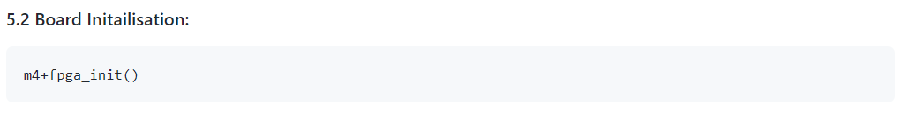
  - The code used to initialize the LED module is given below
  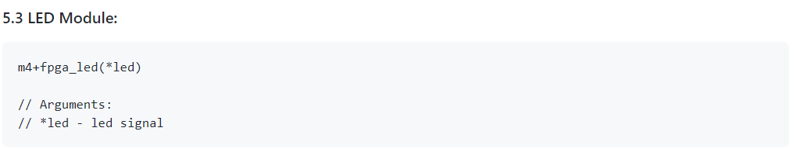
  - The video recorded during the LED Simulation is given below
  - The code used for this simulation.
  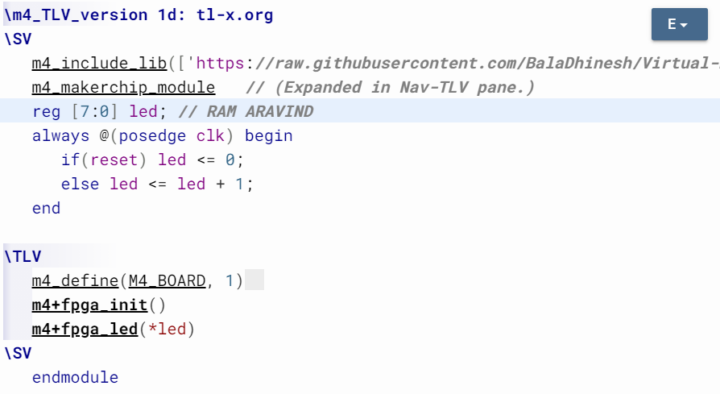
  - The link to the Led interfacing simulation is provided : [Link](https://makerchip.com/sandbox/031fmhjM2/0O7h250)
  
  ## **_7segment Display Interfacing_**
  - The Circuit of 7segment Display is given below
  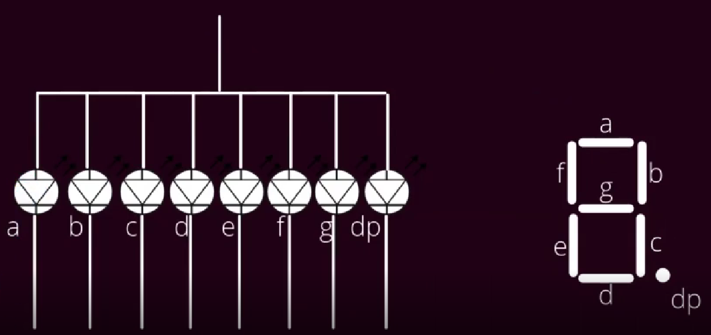
  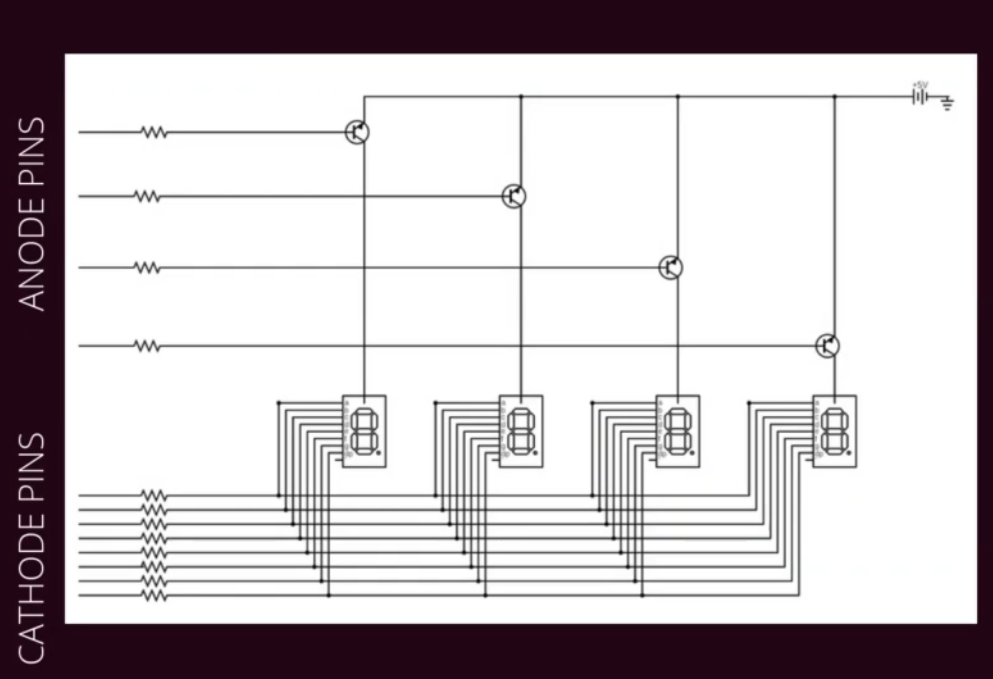
  - The code used to initialize the 7segment Display module is given below
  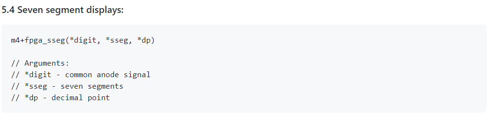
  - The image recorded during the 7segment Display Simulation is given below
  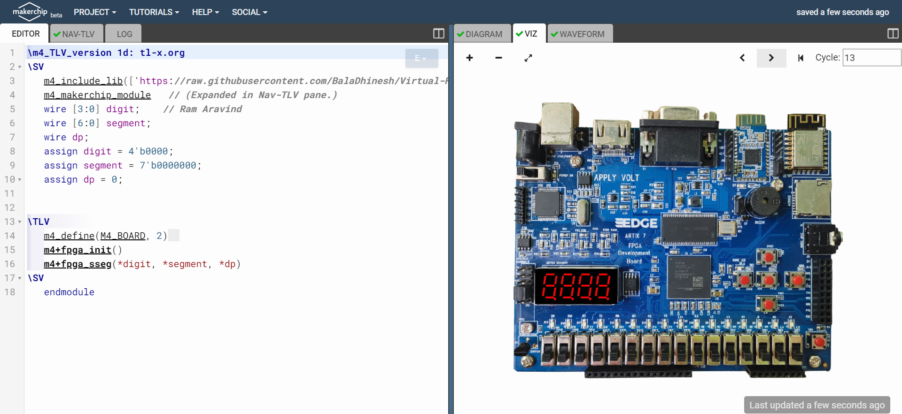
  - The code used for this simulation.
  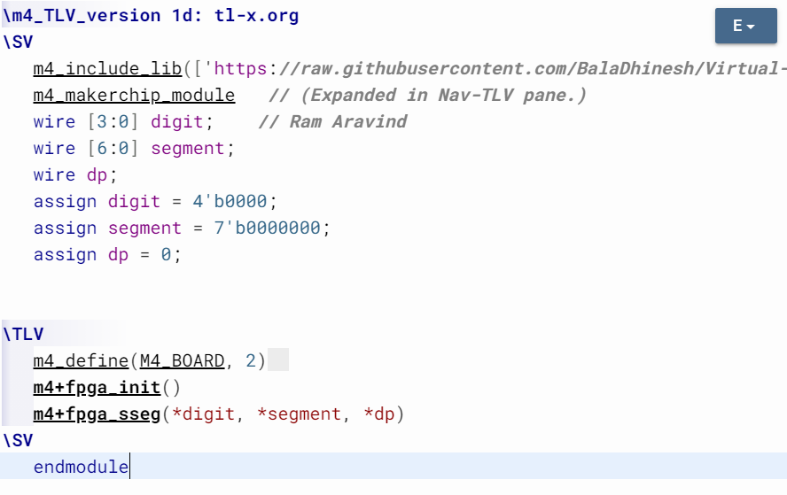
  
  - the link to the Led interfacing simulation is provided : [Link](https://makerchip.com/sandbox/031fmhjM2/0P1h5vZ)
  
  
  ## **_4way Traffic Light Controller Design_**
  - The image of common 4way Traffic Signal is given below
  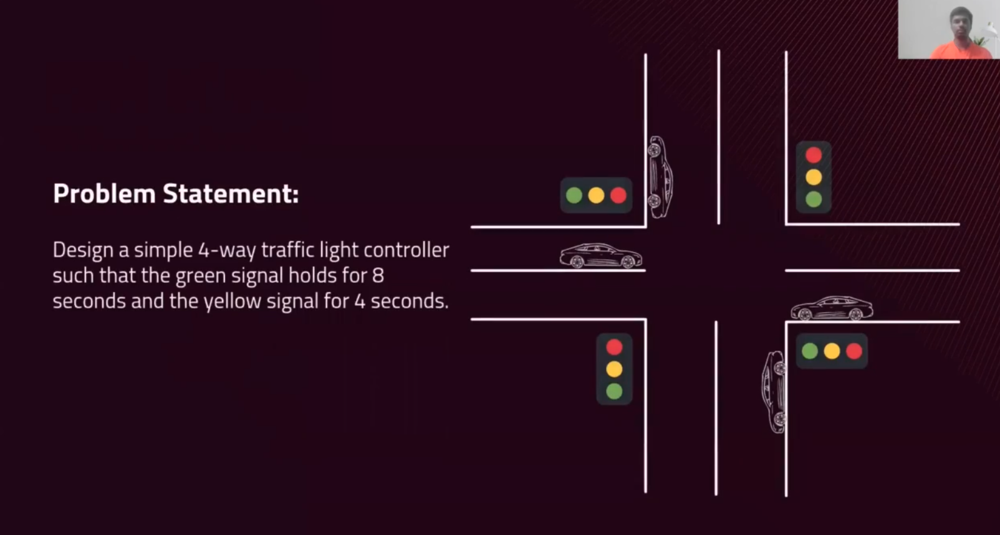
  - The image used to represent the FSM logic is given below
  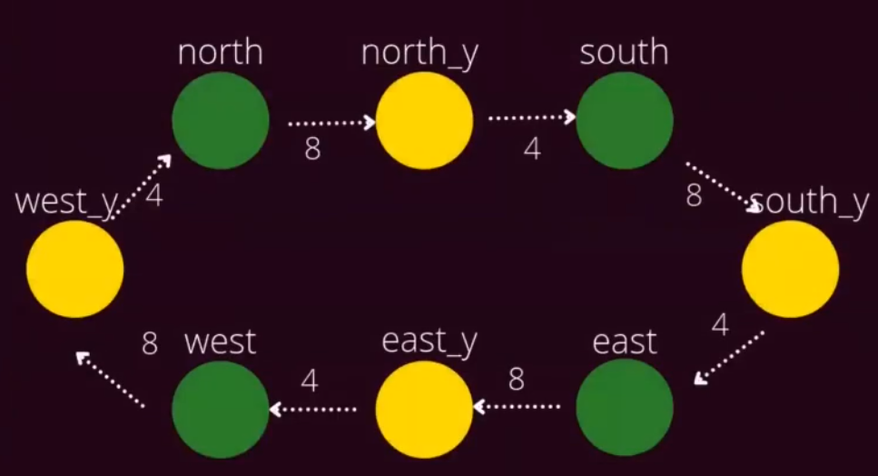
  - The video recorded during the 4-Way Traffic Light Controller Design Simulation is given below.
  - The code used for this simulation is in the link provided : [Link](https://makerchip.com/sandbox/031fmhjM2/0Q1hNBJ#)
  
  ## **_FINITE STATE MACHINE_**
  - Finite state machine logic is abstract model of computation that is used to model logic
  - There are two types of FSM logic: 1) Mealy FSM 2) Moore FSM.
  -  Mealy FSM depends on both input & present state while Moore FSM depends on only present state only.
  - The image of 15 rupee vending machine's Mealy FSM logic is given below
  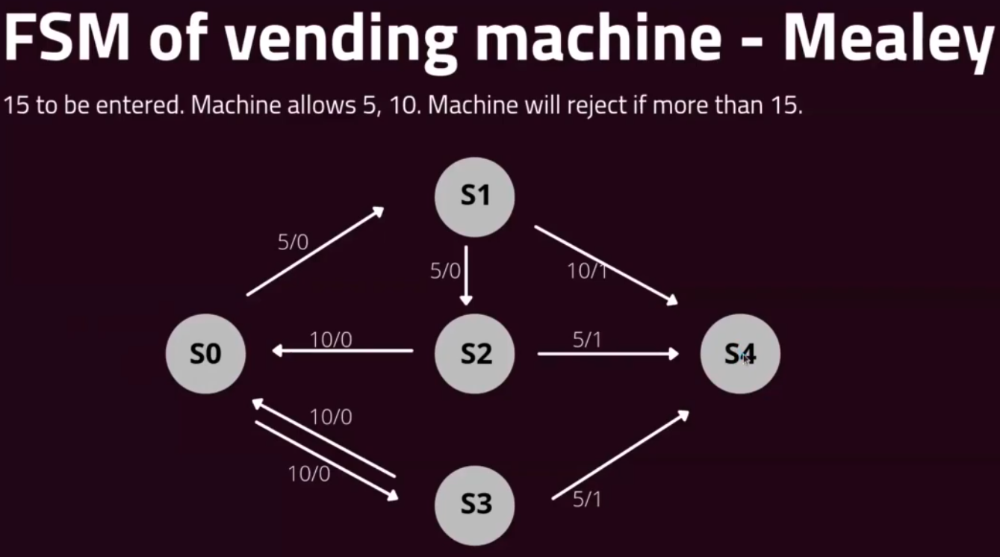
  - The image of 15 rupee vending machine's Moore FSM logic is given below
  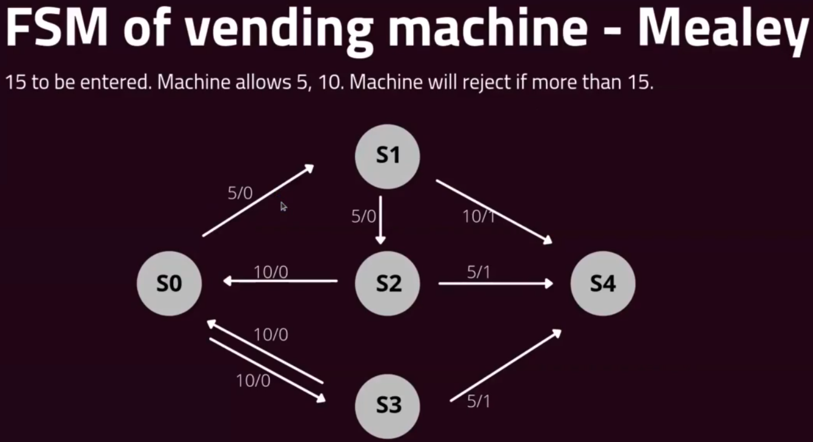
  
  ## **_References_**

- https://github.com/BalaDhinesh/Digital-Design-on-FPGA--VSDOpen21.git
- 
## **_Acknowledgement_**

- Bala Dhinesh, Technical assistant of the course "DIGITAL DESIGN ON  VIRTUAL FPGA" conducted on VSD open tutorial 2021.
- Kunal Ghosh, Co-founder,VLSI System Design.
  
